# aiPiCar - DGMD Fall 2019

## Building a Self-Driving Raspberry Pi Car Capable of Lane Following, Object Recognitions and Obstacle Avoidance
### Project by: Alex Andony

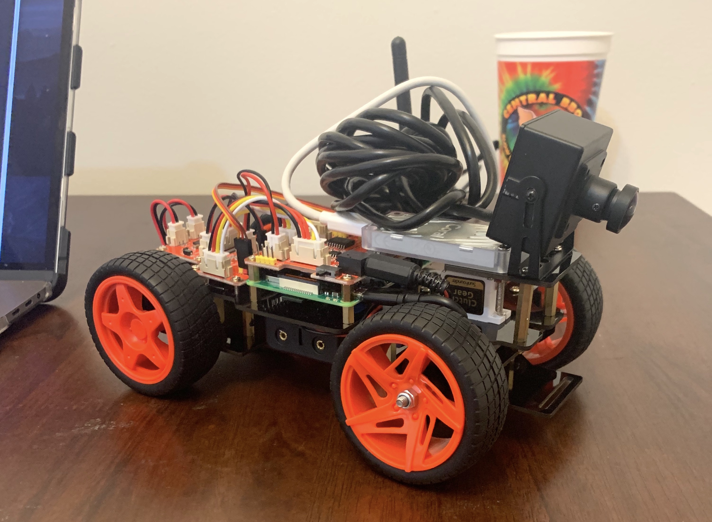

## Project Introduction and Overview

Pick up any news source today, and you’ll likely see something about autopilot technology. Whether it’s lane assistance on production cars, self driving fully autonomous vehicles on the streets of LA, delivery drones autopiloting themselves to delivery drops, or worse, a recent accident caused by testing of these emerging technologies, we can be certain that the industry is rapidly advancing towards adoption of autopilot technology. 

Although major corporations like Tesla and Amazon are pouring billions of dollars into this technology, the practical applications can be learned and demonstrated on a much smaller scale. The goal of this project is to demonstrate these technological concepts using a small Robotic Car powered by a Raspberry Pi, at a price tag under $400. 

#### In order to demonstrate the above technology, we outlined the following goals to demonstrate this behavior:
* Assemble the PiCar Kit and Base Raspberry Pi Operating System 
* Demonstrate Autonomous “Lane Following” through OpenCV
* Demonstrate Advanced Camera recognition features, including adapting to street signs and basic obstacle avoidance
* Demonstrate Advanced Autonomous “Lane Following” using Deep Learning and TensorFlow

#### The build was inspired and heavily influenced by the following web pages:
* [Building a Raspberry Pi Car Robot with WiFi and Video](https://www.hanselman.com/blog/BuildingARaspberryPiCarRobotWithWiFiAndVideo.aspx)
* [DeepPiCar — Part 1: How to Build a Deep Learning, Self Driving Robotic Car on a Shoestring Budget](https://towardsdatascience.com/deeppicar-part-1-102e03c83f2c)
* [Road Lane Detection with Raspberry Pi](https://www.hackster.io/Abhinav_Abhi/road-lane-detection-with-raspberry-pi-a4711f)
* [End to End Learning for Self-Driving Cars](https://arxiv.org/abs/1604.07316)

## Hardware and Software Overview
#### Hardware Used for aiPiCar:
* Car Kit Used: [SunFounder Smart Car Kit](https://www.amazon.com/gp/product/B06XWSVLL8/ref=ppx_yo_dt_b_asin_title_o00_s02?ie=UTF8&psc=1)
* CPU: [Raspberry Pi 3 B+ (B Plus)](https://www.amazon.com/gp/product/B07BC6WH7V/ref=ppx_yo_dt_b_asin_title_o00_s02?ie=UTF8&psc=1)
* MicroSD: [Kingston 64GB MicroSD Card](https://www.amazon.com/gp/product/B079GVC5B8/ref=ppx_yo_dt_b_asin_title_o00_s00?ie=UTF8&psc=1)
* Batteries: [Generic 18650 Batteries x4 + Charger](https://www.amazon.com/gp/product/B07T93HQYZ/ref=ppx_yo_dt_b_asin_title_o00_s01?ie=UTF8&psc=1)
* Upgrade 1 - Wide Angle Camera: [WLP Wide Angle USB Camera](https://www.amazon.com/gp/product/B01N07O9CQ/ref=ppx_yo_dt_b_asin_title_o00_s02?ie=UTF8&psc=1)
* Upgrade 2 - CPU Upgrade: [Coral EdgeTPU USB Accelerator](https://www.amazon.com/gp/product/B07S214S5Y/ref=ppx_yo_dt_b_asin_title_o00_s03?ie=UTF8&psc=1)

#### Software Used for aiPiCar:
* Raspberry Pi OS: [Rasbpian Buster v. Sept 2019](https://www.raspberrypi.org/downloads/raspbian/)
* Remote File Server: Samba File Server 
``` ~sudo apt-get install samba samba-common-bin -y ```
* Camera Driver Utlity: v4l2 Linux 
``` ~sudo apt-get install v4l-utils ```
* Remote Car Control: SunFounder PiCar ``` ~git clone https://github.com/dctian/SunFounder_PiCar.git ```
* Python v3.7.3
* Open CV v4.1.1
* Matplotlib v3.0.2
* tensorflow v1.14.0
* Keras v2.3.1

#### Hardware/ Software for Laptop Setup:
* Laptop: Apple Macbook Pro
* Software: macOS Catalina v10.15.1
* MicroSD card flasher for Pi: [BalenaEtcher](https://www.balena.io/etcher/)
* Remote Desktop Viewer for Pi: [RealVNC](https://www.realvnc.com/en/connect/download/viewer/)

#### Additional Resources Used:
* Lego Figurines 10 Pack (Amazon)
* Street Signs: [Attatoy Kids Playset Signs](https://www.amazon.com/gp/product/B01A8XTHHA/ref=ppx_yo_dt_b_asin_title_o00_s01?ie=UTF8&psc=1)
* Blue Painters Tape for Lanes (Hardware Store)

## Building the aiPiCar

Bulding the aiPiCar was relatively easy. For the most part, I was able to follow the instructions from the manufacturer, with a few key diviations outlines below.

[Manufacturer Build Instructions](https://www.sunfounder.com/learn/download/X1BWQ19SYXNwYmVycnlfUGlfU21hcnRfVmlkZW9fQ2FyX1YyLjAucGRm/dispi)

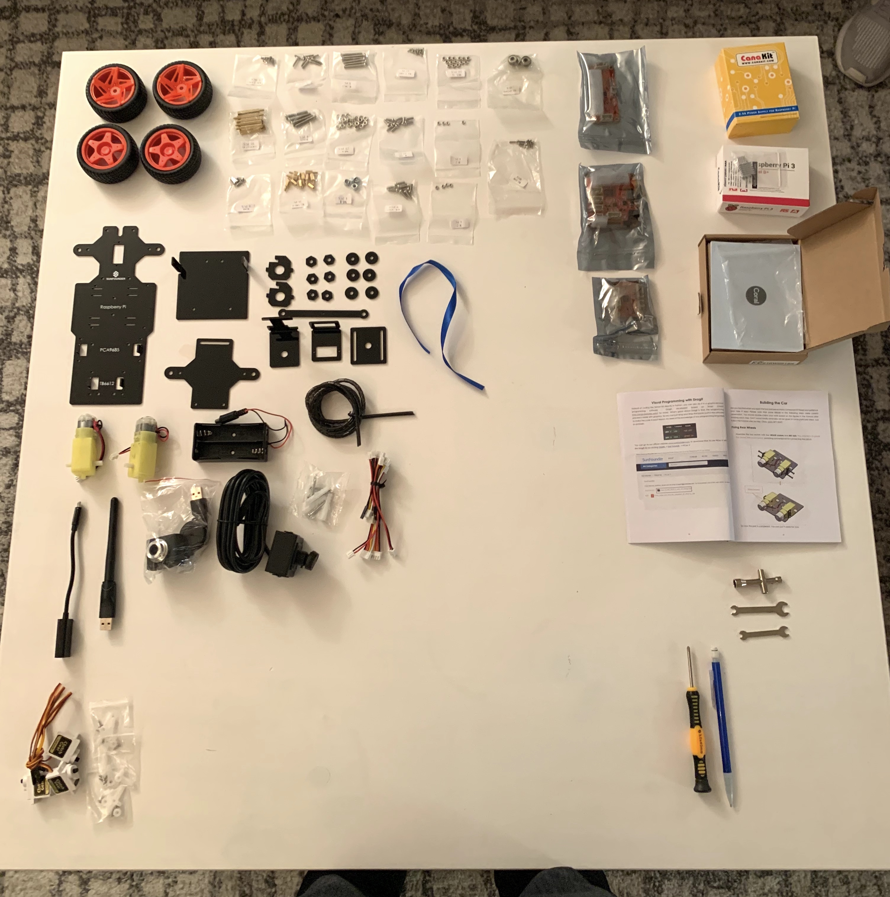

###### PiCar Components Laid Out

### Installing Heatsinks

**(Before Page 16, PCB Assembly)** - Install heatsinks on Respberry Pi Board

Before Installing the HATS on the Pi board during install, I needed to install the heatsinks directly to the Raspberry Pi board. To do so, all that was required was to remove the backing strip on the heatsink to expose the adhesive paste, and to push the ehatsinks onto the CPU and network card as shown below:

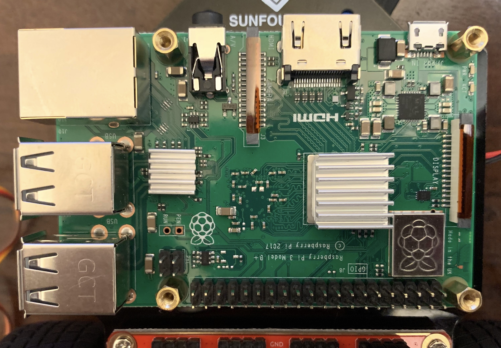

###### Heatsinks applied to Pi Board

### Installing Upgraded Camera

**(Before Page 33, Pan-and-Tilt)** - Install upgraded USB Camera on aiPiCar

As recommended on the build site I referenced above, the camera that ships with the PiCar kit is an extremely low quality narrow lens. I ordered a 170 degree wide angle USB camera as a replacement, which was relatively easy to install with slight modification to the stock mounting plate. The experiment below illustrates the difference between the stock and “upgraded” camera.

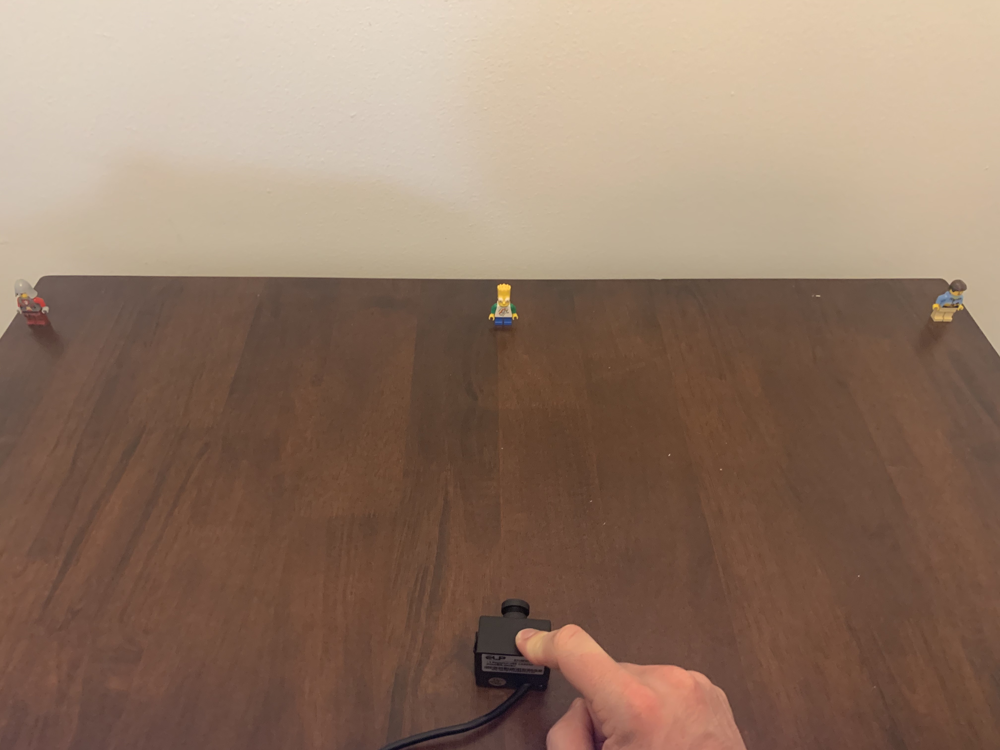

###### Camera Placed roughly 16" from lego figurines on table

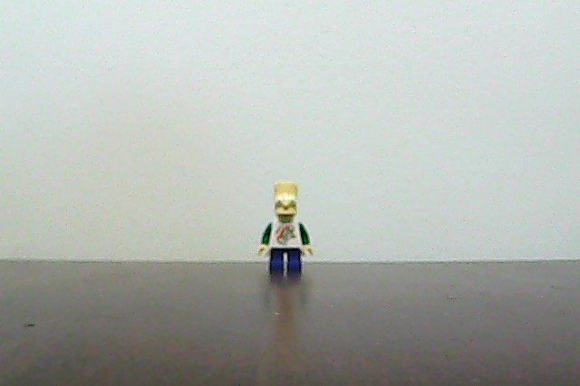

###### Stock Camera View at 16"


###### Upgraded Camera at 16"

To install the camera, rather than installing the stock pan and tilt servos, I secured the USB Camera directly to the Servo Plate using two M3x8 Cross Screws and M3 Nuts. The camera provided a wide enough lens that the pan and tilt servos were unnecessary.

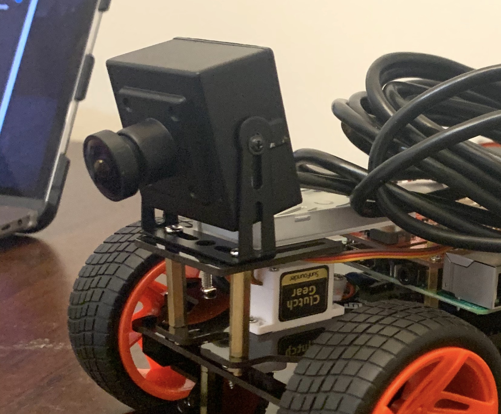

###### Upgraded Camera Mounted on Servo Plate

### Installing Edge TPU Processor

**(Before Page 33, Pan-and-Tilt)** - Install Google EdgeTPU Processor

In order to take some of the processing load off of the Pi for image processing and running Object Detection in TensorFlow, I installed Google’s Edge Tensor Processing Unit USB. At an extremely low cost, it was an easy upgrade to allow the car to process images much more rapidly while leaving the onboard Pi CPU open for performing navigation.

Physical installation was very easy. I simply threaded one M3x8 screw through the top corner of the edgeTPU and secured it with an M3 nut. 

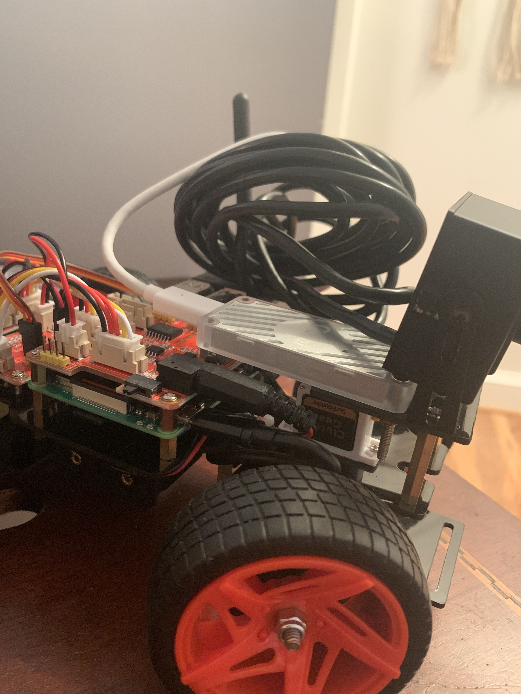

###### Google edgeTPU mounted to Servo Plate behind camera

## Raspberry Pi Software Setup

### RaspianOS Install

I installed Raspbian OS directly from the Raspberry Pi site. I initially tried to use the NOOBS installer package, but ran into issues with a known software bug no allowing the NOOBS installer to display on an HDMI connected monitor. To solve this, I reformatted the microSD card and flashed the RaspianOS directly to the card using BalenaEtcher (linked above). After reconnecting the HDMI, keyboard and mouse, I was able to see the Pi desktop below:

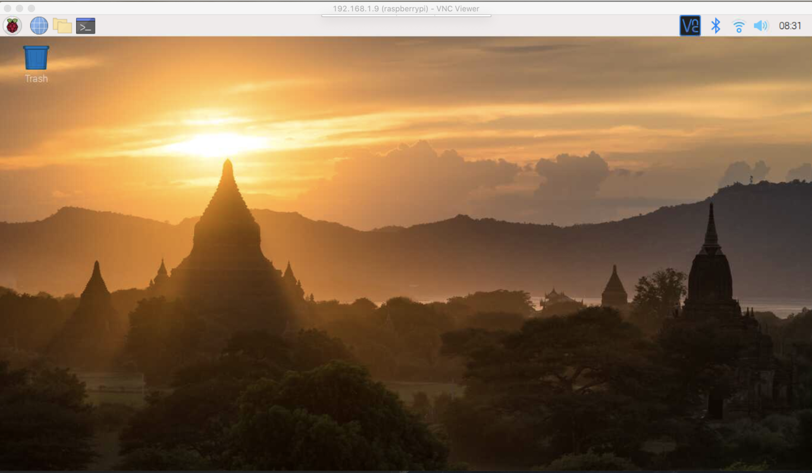

### Setup Remote Client to macOS: 

After the RaspianOS was setup on the Pi and I was able to see the desktop, the next goal was to setup a VNC Server on the Pi and VNC Viewer on macOS. I used the free software RealVNC to accomplish this.

Step One: Enable SSH and VNC through the Pi’s Interface Settings

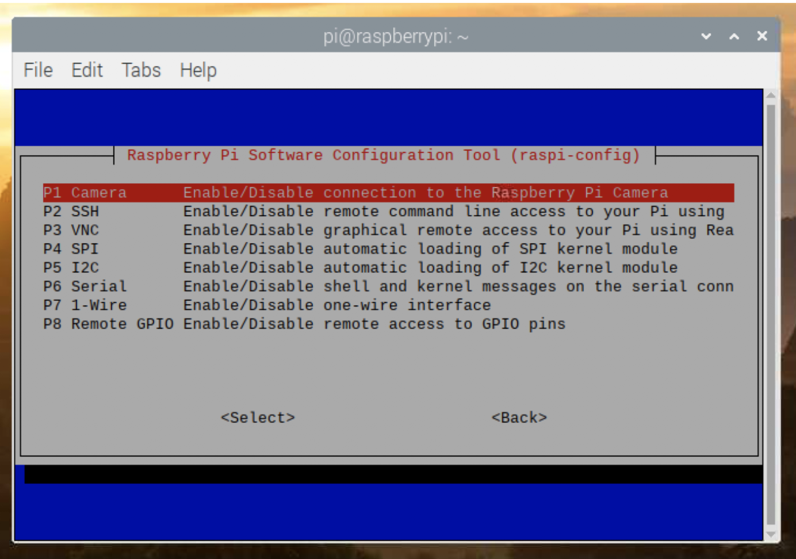

Step Two: Download RealVNC on Mac and enter the IP address of the Pi

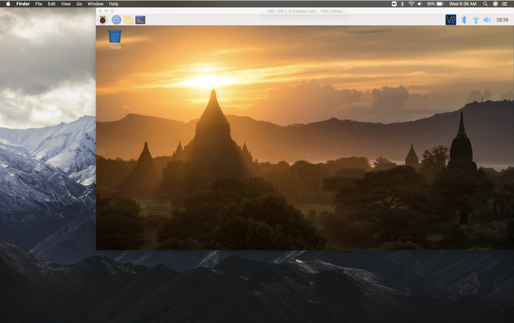

### Setup Remote File Server

In order to be able to easily read/ write files from the Pi without needed to constantly disconnect the SD card, I wanted to setup remote file access to the file system. To do this, I installed SAMBA file server on the Pi using the directions found [here](https://pimylifeup.com/raspberry-pi-samba/). Once the server was setup on the Pi, I was able to connect using the Mac instructions found [here](http://osxdaily.com/2010/09/20/map-a-network-drive-on-a-mac/). 


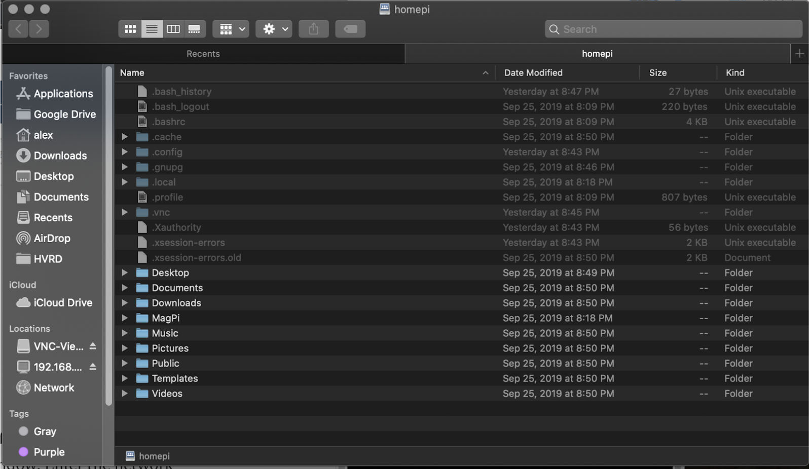

###### Screenshot of the file server accessible through the macOS

### SunFounder PiCar-V Software Setup

Unfortunately, the Manufacturer's server code runs on Python 2, while we are running the project on Python 3. Thankfully, the author of one of the tutorials I am following (David Tian, linked above) has updated the repo to be Python 3 compatible. Commands to install his version of the Servewr API are found below:

```
alias python=python3
alias pip=pip3
alias sudo='sudo '
pi@raspberrypi:~ $ git clone https://github.com/dctian/SunFounder_PiCar.git
pi@raspberrypi:~ $ cd ~/SunFounder_PiCar/picar/
pi@raspberrypi:~/SunFounder_PiCar/picar $ git clone https://github.com/dctian/SunFounder_PCA9685.git
pi@raspberrypi:~/SunFounder_PiCar/picar $ cd ~/SunFounder_PiCar/
pi@raspberrypi:~/SunFounder_PiCar $ sudo python setup.py install
pi@raspberrypi:~/SunFounder_PiCar/picar $ cd
pi@raspberrypi:~ $ git clone https://github.com/dctian/SunFounder_PiCar-V.git
pi@raspberrypi:~ $ cd SunFounder_PiCar-V
pi@raspberrypi:~/SunFounder_PiCar-V $ sudo ./install_dependencies
```

### Installing Python and Dependant Packages

Once the OS was up and running, we need to install the other packages we will be utilizing:
* Install Open CV: 

``` pi@raspberrypi:~ $  sudo apt-get install libhdf5-dev -y && sudo apt-get install libhdf5-serial-dev -y && sudo apt-get install libatlas-base-dev -y && sudo apt-get install libjasper-dev -y && sudo apt-get install libqtgui4 -y && sudo apt-get install libqt4-test -y ```

###### NOTE python3-open cv, NOT opencv-python. This caused me lots of headaches and research time to solve initially.

``` pi@raspberrypi:~ $ pip3 install python3-opencv ```

* Install Matplotlib:

``` pi@raspberrypi:~ $ pip3 install matplotlib ```

* Install tensorflow:

``` pi@raspberrypi:~ $ pip3 install tensorflow ```

* Install keras:

``` pi@raspberrypi:~ $ pip3 install keras ```

### Installing Google edgeTPU

Similar to the above mentioned problem with python3 and OpenCV compatibility, there were some issues intially with compatibility between Google's edgeTPU and Rasbpian Buster. The original install instructions for the edgeTPU can be found below.

[Google EdgeTPU Install Instructions](https://coral.withgoogle.com/docs/accelerator/get-started/)

Again, fortunately, I was able to find a github repo with workaround instructions for Raspian and EdgeTPU compatibility. Instructructions followed below, under "Getting the Coral to work with the Pi 4":

[leswright1977/RPi4-Google-Coral](https://github.com/leswright1977/RPi4-Google-Coral)

### Testing Installed Packages:

Once all the packages have installed and are running without errors, I used David Tian's repo and "coco_object_detection" to make sure was running smoothly. In David's words:

> You should see a live video screen coming up, and it will try to identify objects in the screen at around 7–8 Frames/sec. Note that the COCO (Common Object in COntext) object detection model can detect about 100 common objects, like a person, chair, TV, couch, book, laptop, cell phone, etc. Don’t let this simple program fool you, this is Deep Learning at work. The object detection model used in this program is called ssd_mobilenet_coco_v2, and it contains more than 200 layers!

To run the python program:

```
pi@raspberrypi:~ $ git clone https://github.com/dctian/DeepPiCar.git
pi@raspberrypi:~ $ cd ~/DeepPiCar/models/object_detection/
pi@raspberrypi:~/DeepPiCar/models/object_detection $ python3 code/coco_object_detection.py 
```
As you can see, our aiPiCar was able to perform some object recognition:

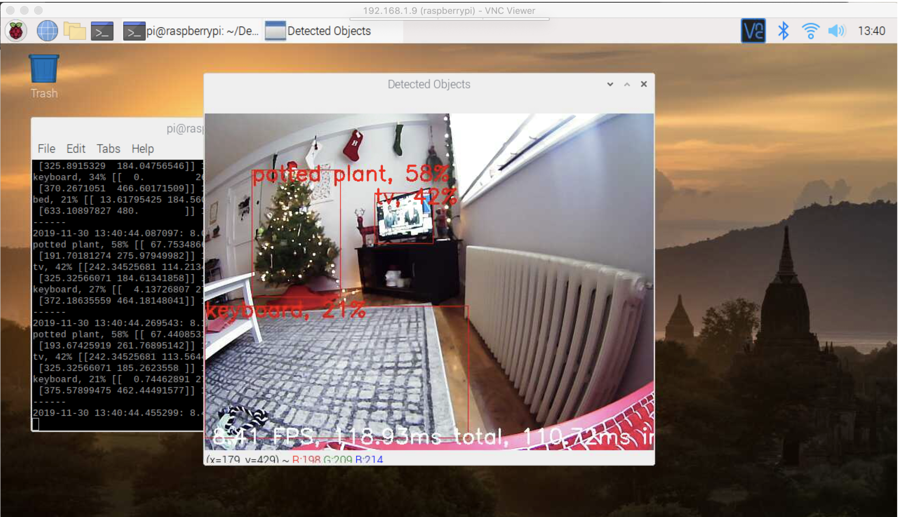

###### In the words of Neo - "I know Kung Fu!"

## Testing the aiPiCar

Now that the hardware and software have been setup for the aiPiCar, I was able to use the SunFounder's built in controller to demo the motor functions and camera features. To do so, we need to first run the PiCar server on the Pi, and then connect locally to the Server in order to operate the car remotely:

Step One: Start aiPiCar Server

```
cd ~/SunFounder_PiCar-V/remote_control 
sudo ./start 
```

Step Two: Connect to localhost from web browser

**http://{pi's IP address}:8000/**

Video of the aiPiCar operating via remote control:

[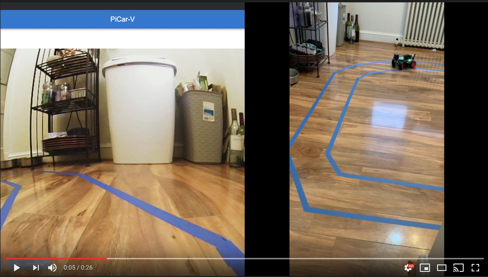](https://www.youtube.com/watch?v=Bf4ltXj-Qyw)

## Lane Detection and Self Driving Part One: OpenCV

The first challenge was to process live fottage through the aiPiCar's camera and process it through multiple OpenCV filters in order to render detectable lane lines, and ultimately navigate the lane line autonomously. To accomplish this, I first took the camera footage stream from the car, and then applied the filters as outlined below.

###### Note: Source code can be found in github repo, under open_cvtest.py

### Display Raw Video Stream

```python
import cv2
import numpy as np
import math

def main():
    camera = cv2.VideoCapture(0)
    camera.set(3, 640) #width
    camera.set(4, 480) #height

    while( camera.isOpened()):
        _, frame = camera.read()    
        cv2.imshow('Original', frame)
        
    ...
    
    if( cv2.waitKey(1) & 0xFF == ord('q') ): 
            break
    camera.release()        
    cv2.destroyAllWindows()
    
if __name__ == '__main__':
    main()
```

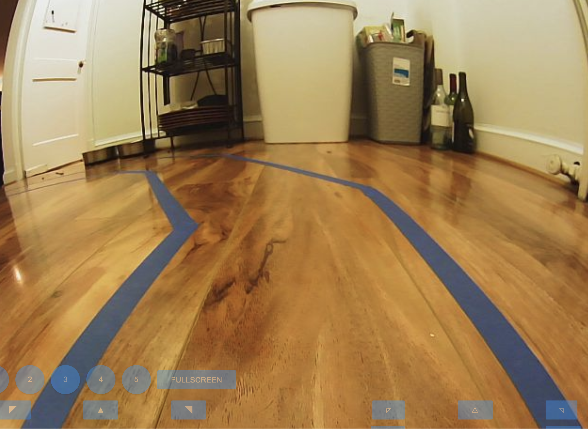

###### Raw Video Input

### Apply HSV Color Filter

```python
hsv_image = cv2.cvtColor(frame, cv2.COLOR_BGR2HSV)
cv2.imshow('HSV', hsv_image)
```

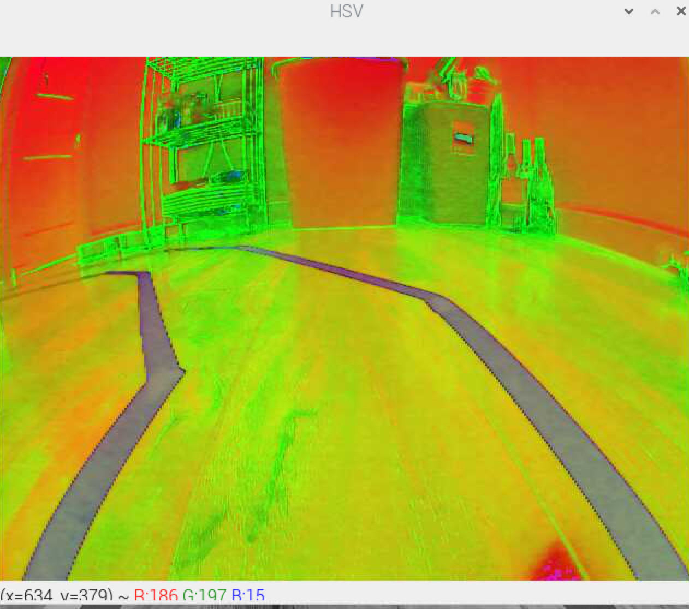

###### Video with HSV Filter

### Apply Blue Color Mask

```python
lower_blue = np.array([60, 40, 40])
upper_blue = np.array([150, 255, 255])
mask = cv2.inRange(hsv_image, lower_blue, upper_blue)
cv2.imshow('mask', mask)
```
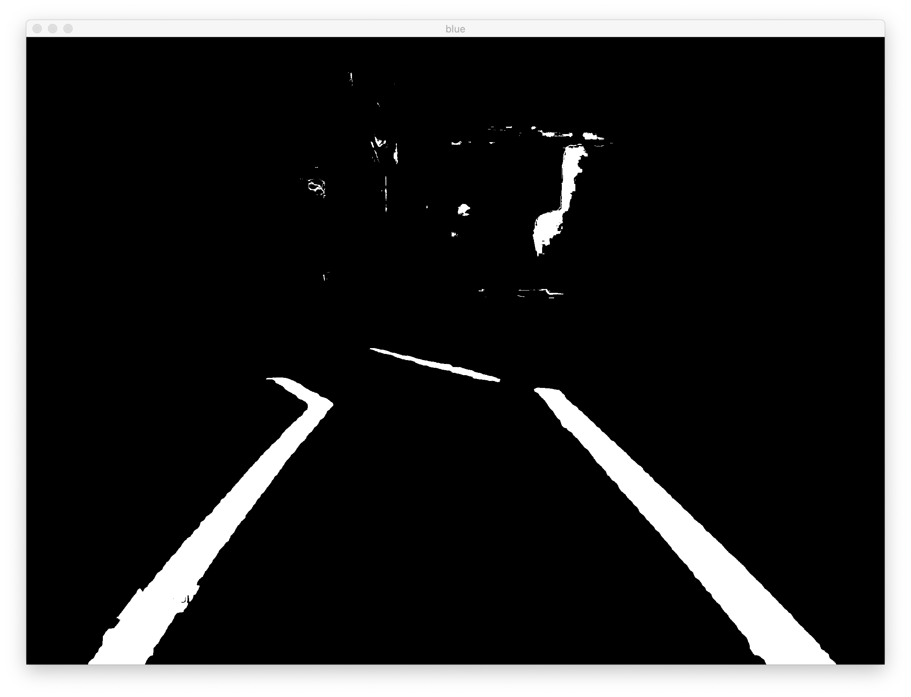

###### Video with Blue Mask Filter

### Detect Edges of Mask with Canny

```python
edges = cv2.Canny(mask, 200, 400)
cv2.imshow('edges', edges)
```

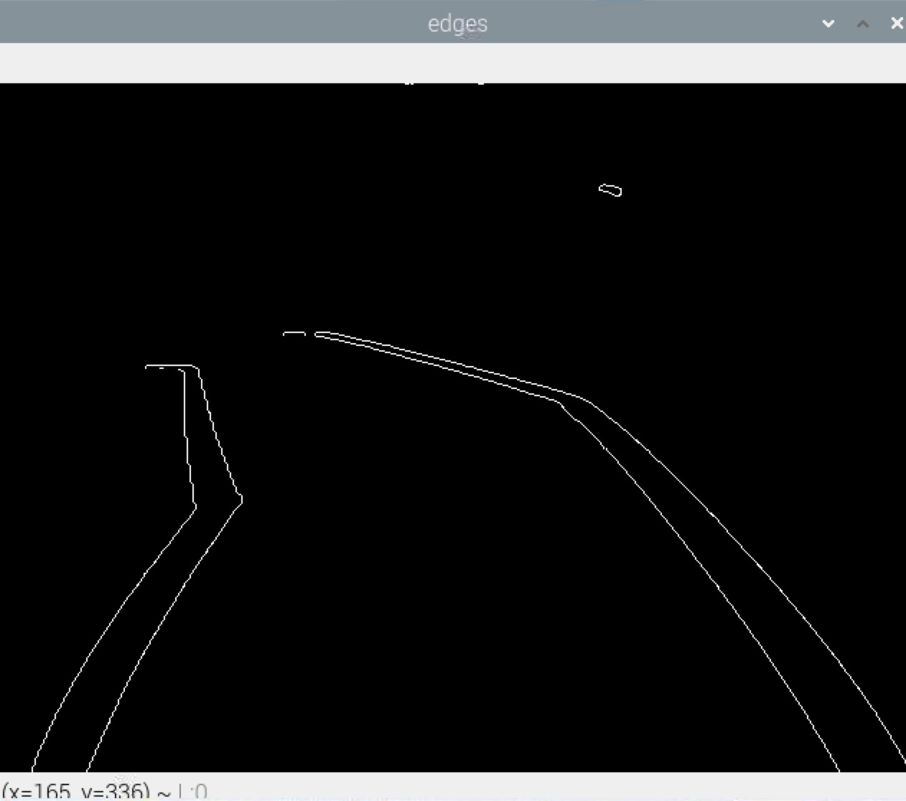

###### Video with Mask Canny Edges Filter

### Isolate Region of Interest (Lower Half of Image)

```python
mask = np.zeros_like(edges)
polygon = np.array([[
      (0, height * 1 / 2),
      (width, height * 1 / 2),
      (width, height),
      (0, height),
]], np.int32)
cv2.fillPoly(mask, polygon, 255)
cropped_edges = cv2.bitwise_and(edges, mask)
cv2.imshow('cropped_edges', cropped_edges)
```

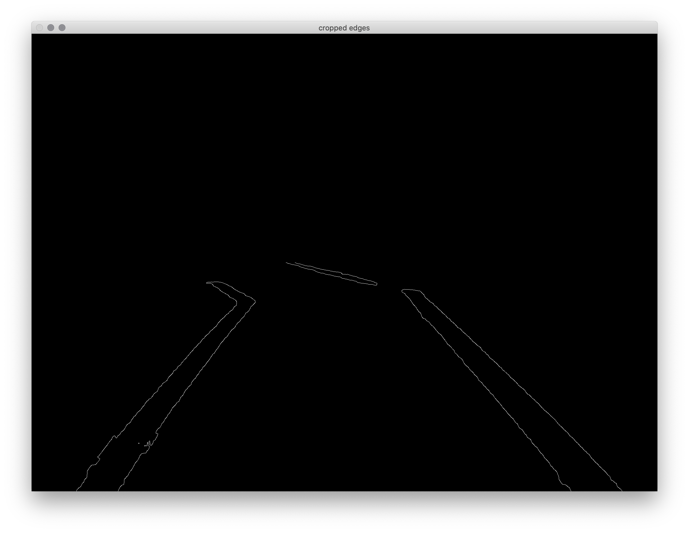

###### Video with Mask Canny Edges Filter, Cropped

### Detect Line Segments Using Hough Transform and Overlay Original Video

```python
rho = 1  # distance precision in pixel, i.e. 1 pixel
angle = np.pi / 180  # angular precision in radian, i.e. 1 degree
min_threshold = 10  # minimal of votes
line_segments = cv2.HoughLinesP(cropped_edges, rho, angle, min_threshold, np.array([]), minLineLength=8, maxLineGap=4)

lane_lines = []
    if line_segments is None:
        logging.info('No line_segment segments detected')
        return lane_lines

    height, width, _ = frame.shape
    left_fit = []
    right_fit = []

    boundary = 1/3
    left_region_boundary = width * (1 - boundary)  
    right_region_boundary = width * boundary 

    for line_segment in line_segments:
        for x1, y1, x2, y2 in line_segment:
            if x1 == x2:
                logging.info('skipping vertical line segment (slope=inf): %s' % line_segment)
                continue
            fit = np.polyfit((x1, x2), (y1, y2), 1)
            slope = fit[0]
            intercept = fit[1]
            if slope < 0:
                if x1 < left_region_boundary and x2 < left_region_boundary:
                    left_fit.append((slope, intercept))
            else:
                if x1 > right_region_boundary and x2 > right_region_boundary:
                    right_fit.append((slope, intercept))

    left_fit_average = np.average(left_fit, axis=0)
    if len(left_fit) > 0:
        lane_lines.append(make_points(frame, left_fit_average))

    right_fit_average = np.average(right_fit, axis=0)
    if len(right_fit) > 0:
        lane_lines.append(make_points(frame, right_fit_average))

    logging.debug('lane lines: %s' % lane_lines)  

    return lane_lines

    height, width, _ = frame.shape
    slope, intercept = line
    y1 = height  
    y2 = int(y1 * 1 / 2)  
    x1 = max(-width, min(2 * width, int((y1 - intercept) / slope)))
    x2 = max(-width, min(2 * width, int((y2 - intercept) / slope)))
    return [[x1, y1, x2, y2]]

    line_image = np.zeros_like(frame)
    if lines is not None:
        for line in lines:
            for x1, y1, x2, y2 in line:
                cv2.line(line_image, (x1, y1), (x2, y2), line_color=(0, 255, 0), line_width=2)
    line_image = cv2.addWeighted(frame, 0.8, line_image, 1, 1)
    return line_image
```

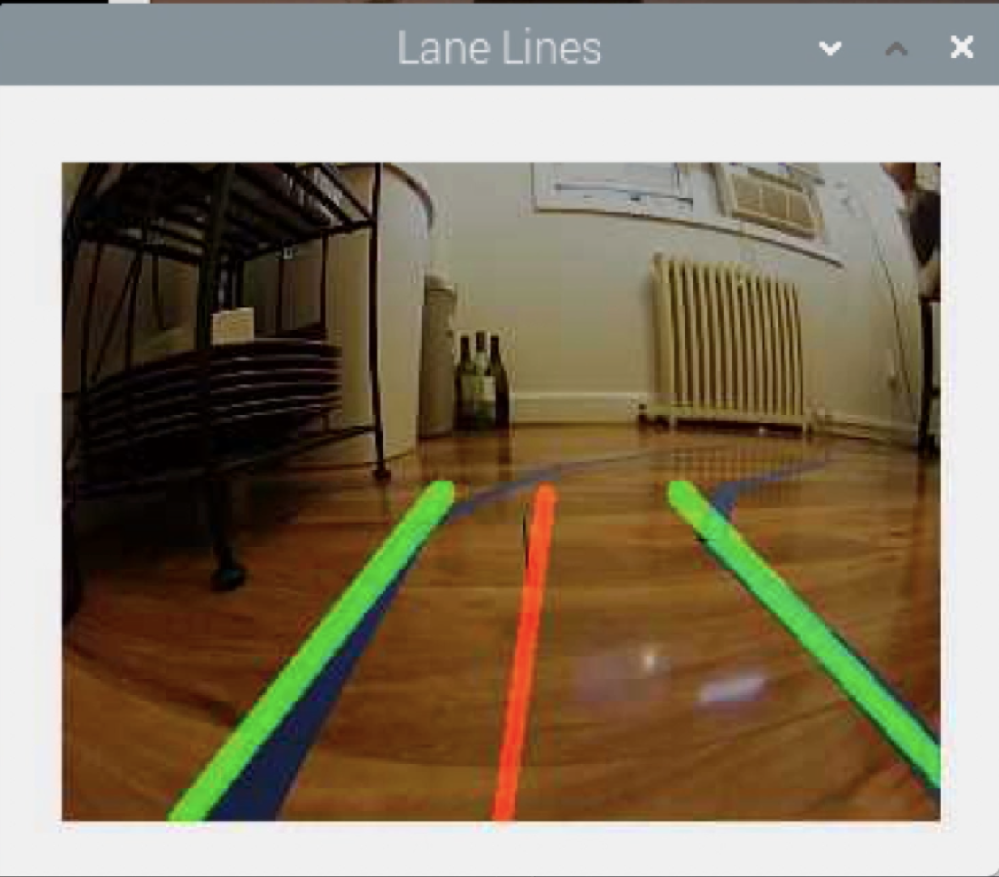

###### Raw Video with Houghes Transform Overlay

### Adding Motion through PiCar and DeepPiCar Tutorial

Once the video was processing and filtering correctly, allowing for the car to self correct motion proved a bit mroe challenging. As I am relatively new to python programming, I heavily leaned on the DeepPiCar tutorial referenced above, while modifying the source code to work with my image filtering.

Code Used:
```python
#Compute Heading
_, _, left_x2, _ = lane_lines[0][0]
_, _, right_x2, _ = lane_lines[1][0]
mid = int(width / 2)
x_offset = (left_x2 + right_x2) / 2 - mid
y_offset = int(height / 2)
#Adjust Sensitivity to number of lane lines
x1, _, x2, _ = lane_lines[0][0]
x_offset = x2 - x1
y_offset = int(height / 2)
#Compute Steering Angle
angle_to_mid_radian = math.atan(x_offset / y_offset)  
angle_to_mid_deg = int(angle_to_mid_radian * 180.0 / math.pi)  
steering_angle = angle_to_mid_deg + 90  
#displayheadingline
def display_heading_line(frame, steering_angle, line_color=(0, 0, 255), line_width=5 ):
    heading_image = np.zeros_like(frame)
    height, width, _ = frame.shape

    # figure out the heading line from steering angle
    # heading line (x1,y1) is always center bottom of the screen
    # (x2, y2) requires a bit of trigonometry

    # Note: the steering angle of:
    # 0-89 degree: turn left
    # 90 degree: going straight
    # 91-180 degree: turn right 
    steering_angle_radian = steering_angle / 180.0 * math.pi
    x1 = int(width / 2)
    y1 = height
    x2 = int(x1 - height / 2 / math.tan(steering_angle_radian))
    y2 = int(height / 2)

    cv2.line(heading_image, (x1, y1), (x2, y2), line_color, line_width)
    heading_image = cv2.addWeighted(frame, 0.8, heading_image, 1, 1)

    return heading_image
#Stabalize
def stabilize_steering_angle(
          curr_steering_angle, 
          new_steering_angle, 
          num_of_lane_lines, 
          max_angle_deviation_two_lines=5, 
          max_angle_deviation_one_lane=1):
    """
    Using last steering angle to stabilize the steering angle
    if new angle is too different from current angle, 
    only turn by max_angle_deviation degrees
    """
    if num_of_lane_lines == 2 :
        # if both lane lines detected, then we can deviate more
        max_angle_deviation = max_angle_deviation_two_lines
    else :
        # if only one lane detected, don't deviate too much
        max_angle_deviation = max_angle_deviation_one_lane
    
    angle_deviation = new_steering_angle - curr_steering_angle
    if abs(angle_deviation) > max_angle_deviation:
        stabilized_steering_angle = int(curr_steering_angle
            + max_angle_deviation * angle_deviation / abs(angle_deviation))
    else:
        stabilized_steering_angle = new_steering_angle
    return stabilized_steering_angle
```

###### Note: Compiled code can be found in Github Repo, under aiPiCarOpenCV.py

Video of the aiPiCar autonomously navigating lane lines:

[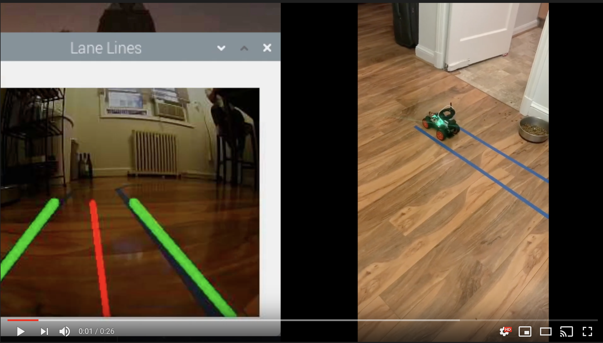](https://youtu.be/dGva-cCV_7U)

## Sign Recognition and Obstacle Avoidance

After the aiPiCar was succesfully able to navigate the lane lines and follow the blue tape course, the next step was to build and train an object recognition model in order to autonomously alter the car's behavior when recognizing various objects, signs and people. The objects we wanted to train and account for were:
* Stop Sign: When the aiPiCar recognizes a stop sign, the car should come to a stop, wait, and then continue driving
* Person: When the aiPiCar recognizes a (lego) person, the car should come to a stop and wait until the person is no longer in the path of the car
* 25 mph Sign: When the aiPiCar recognizes a 25 mph sign, the car should slow speed until given a new speed limit
* 40 mph Sign: When the aiPiCar recognizes a 40 mph sign, the car should increase speed until given a new speed limit

### Model Training

In order to train the object recognition model, we used a method called "Transfer Learning" that allows you to leverage an existing model, rather than building a new model from scratch. Once you select a model to work from, you can feed it defined images and train the model to recognize the specifc objects you are working with. The reasoning is well-stated by David Tian's tutorial article:

> "We don’t want to collect and label hundreds of thousands of images and spend weeks or months to construct and train a deep detection model from scratch. What we can do is to leverage Transfer Learning — which starts with the model parameters of a pre-trained model, supply it with only 50–100 of our own images and labels, and only spend a few hours to train parts of the detection neural network. The intuition is that in a pre-trained model, the base CNN layers are already good at extracting features from images since these models are trained on a vast number and large variety of images. The distinction is that we now have a different set of object types (6) than that of the pre-trained models (~100–100,000 types)."

Note: the following articles were extremely helpful to the training process:
* [DLology Training Object Detection Models](https://www.dlology.com/blog/how-to-train-an-object-detection-model-easy-for-free/)
* [DeepPiCar — Part 6: Traffic Sign and Pedestrian Detection and Handling](https://towardsdatascience.com/deeppicar-part-6-963334b2abe0)

For this project, the recommended existing model to train was the MobileNet v2 SSD COCO Quantized Model. We specifically need the quantized version of the mdoel, because the Google EdgeTPU is specifically designed to work with quantized models. 

The first step of the process is to take a number of training images used to train the model. These images show the objects you want the aiPiCar to recognize, at various angles and lighting in the environment the car will operate in. For this project, we took 50 images randomly placing the objects in different combinations and angles, similar to below:


One the images were captured, the next step was to bound and label the images they contain. By taking these raw images and outlining/ labeling the individual objects they contain, these files can be used during the Machine Training process for these objects. 

To accomplish labeling the 50 images, we used an app called [RectLabel](https://rectlabel.com/) This macOS app allows you to predefine the objects you want to label, then quickly cycle through the 50 images while drawing label boxes around the objects in each image. Overall, the process for 50 images took about 60 minutes, with the app exporting an xml file for each image. 

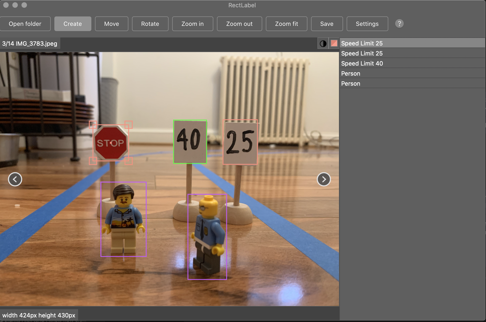

Now that we had the 50 training images, as well as xml files with the labelling data, we were able to actually train our model. The first step to doing so is to convert the xml files into a .tfrecord file. The following code can be used within a google collab notebook to accomplish this:

```
# Convert xml files to a single csv file,
python xml_to_csv.py -i aiPiCar/ObjectTrainingImages/train -o aiPiCar/ObjectTrainingImages/train/train_labels.csv

# Convert test folder annotation xml files to a single csv.
python xml_to_csv.py -i aiPiCar/ObjectTrainingImages/test -oaiPiCar/ObjectTrainingImages/test_labels.csv

# Generate `train.record`
python generate_tfrecord.py --csv_input=aiPiCar/ObjectTrainingImages/train/train_labels.csv --output_path=aiPiCar/ObjectTrainingImages/train/train.record --img_path=data/images/train --label_map aiPiCar/ObjectTrainingImages/train/label_map.pbtxt

# Generate `test.record`
python generate_tfrecord.py --csv_input=aiPiCar/ObjectTrainingImages/test/test_labels.csv --output_path=aiPiCar/ObjectTrainingImages/test/test.record --img_path=data/images/test --label_map aiPiCar/ObjectTrainingImages/test/label_map.pbtxt

```

After the .tfrecord files are generated, we were able to actually train the model. The Following Parameters were used in conjuction with the MobileNet v2 SSD COCO Quantized Model:
* the pre-trained model: MobileNet v2 SSD COCO Quantized Model
* two tfrecord files: test.tfrecord and train.tfrecord generated above
* label_map.pbtxt file: generated above
* training batch size (steps): 2000 
* number of evaluation steps: 50
* number of classes of unique objects: 4

Finally, after the training output file was generated, we needed to convert the output to a TensorFlow Lite flatbuffer file compiled for the Edge TPU. The directions can be found on the Google Documentation [here](https://coral.ai/docs/edgetpu/retrain-detection/).

> 1. To freeze the graph and convert it to TensorFlow Lite, use the following script and specify the checkpoint number you want to use:

```
# From the Docker /tensorflow/models/research directory
./convert_checkpoint_to_edgetpu_tflite.sh --checkpoint_num 500
```

> Your converted TensorFlow Lite model is named output_tflite_graph.tflite and is output in the Docker container at tensorflow/models/research/learn_pet/models/, which is the mounted directory available on your host filesystem at $DETECT_DIR ($HOME/edgetpu/detection/models/)

> 2. Now open a new terminal and compile the model using the Edge TPU Compiler:

```
# Install the compiler:
curl https://packages.cloud.google.com/apt/doc/apt-key.gpg | sudo apt-key add -

echo "deb https://packages.cloud.google.com/apt coral-edgetpu-stable main" | sudo tee /etc/apt/sources.list.d/coral-edgetpu.list

sudo apt update

sudo apt install edgetpu

# Change directories to where the new model is:
cd $HOME/edgetpu/detection/models

# Compile the model:
edgetpu_compiler output_tflite_graph.tflite
```

Once model training was complete, we were able to test the live camera feed against the same objects in real time using our ```objects_quantized_edgetpu.tflite``` file:

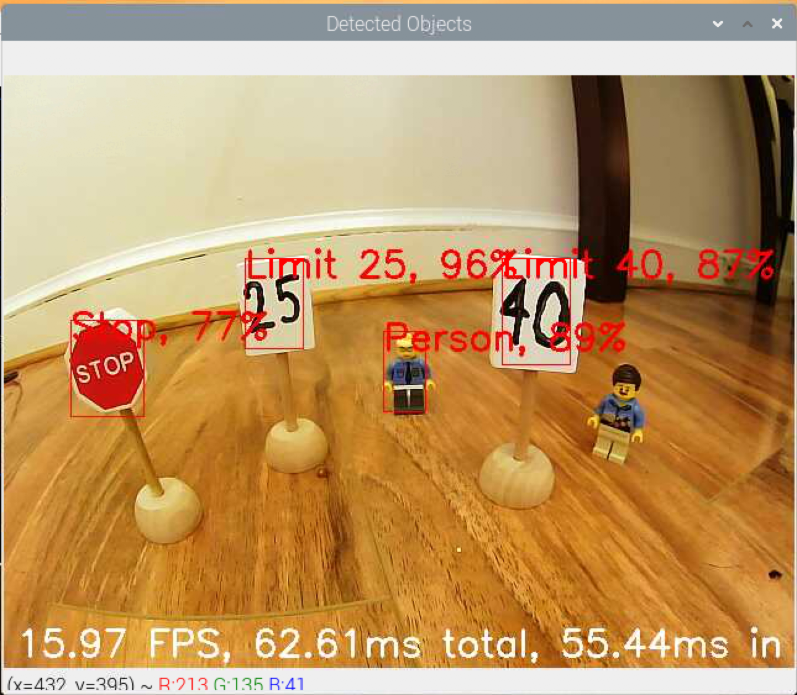

With our object detection working well, the next step was to alter the aiPiCar's behavior when certain objects were recognized.

### Person Avoidance

The code for person avoidance was the easiest to implement. When the model recognizes a lego "person", it sets car speed to zero until the person is no longer recognized, ie removed from the camera frame.

```python
class Pedestrian(TrafficObject):
    def set_car_state(self, car_state):
        logging.debug('pedestrian: stopping car')
        car_state['speed'] = 0
```

The behvaior when the aiPiCar recognizes a person is demonstrated in the video below.

[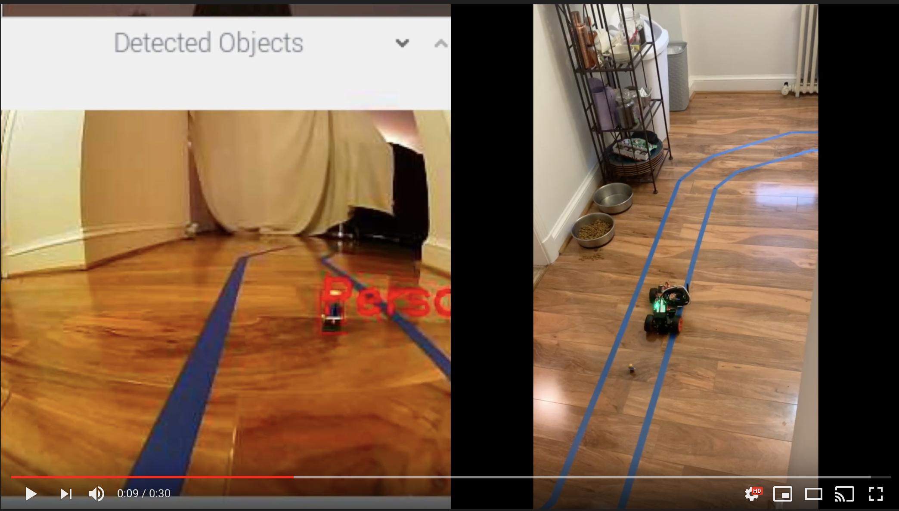](https://youtu.be/EZWdnMRZrPU)

### Stop Sign Adjustments

The code for stop sign behavior was the msot complicated to implement, as there needed to be a state set on initial recognition of the stop sign, which then triggers a wait counter for 3 seconds, before allowing the aiPiCar to proceed. The state implmentation is necessary because the detected stop sign remains in the video frame, which would cause the model to continually recognize the stop sign and kick off 3 second wait counters, rather than just initially. 

```python
class StopSign(TrafficObject):

    def __init__(self, wait_time_in_sec=3, min_no_stop_sign=20):
        self.in_wait_mode = False
        self.has_stopped = False
        self.wait_time_in_sec = wait_time_in_sec
        self.min_no_stop_sign = min_no_stop_sign
        self.no_stop_count = min_no_stop_sign
        self.timer = None

    def set_car_state(self, car_state):
        self.no_stop_count = self.min_no_stop_sign

        if self.in_wait_mode:
            logging.debug('stop sign: 2) still waiting')
            # wait for 2 second before proceeding
            car_state['speed'] = 0
            return

        if not self.has_stopped:
            logging.debug('stop sign: 1) just detected')

            car_state['speed'] = 0
            self.in_wait_mode = True
            self.has_stopped = True
            self.timer = Timer(self.wait_time_in_sec, self.wait_done)
            self.timer.start()
            return

    def wait_done(self):
        logging.debug('stop sign: 3) finished waiting for %d seconds' % self.wait_time_in_sec)
        self.in_wait_mode = False
```

The behvaior when the aiPiCar recognizes a stop sign is demonstrated in the video below.

[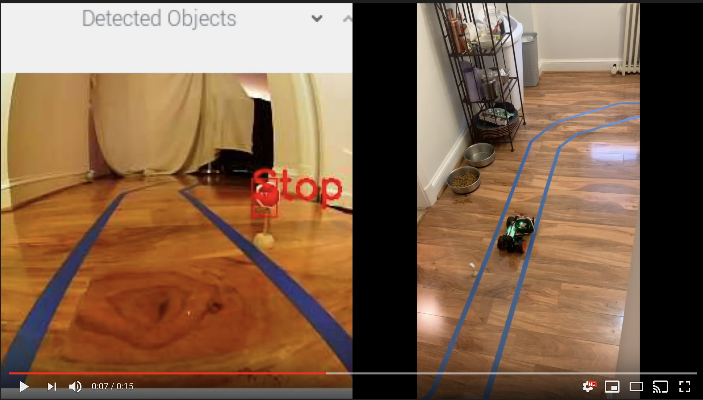](https://youtu.be/SC_2OM8m3Fw)

### 25 mph and 40 mph Adjustments

Similar to the behavior of person detection, Speed limit adjustments were relatively easy to implement due to the set_speed function of the actual SunFounder Pi Car controles, ranging 0-100 in 10 value increments. 

```python
class SpeedLimit(TrafficObject):

    def __init__(self, speed_limit):
        self.speed_limit = speed_limit

    def set_car_state(self, car_state):
        logging.debug('speed limit: set limit to %d' % self.speed_limit)
        car_state['speed_limit'] = self.speed_limit
```

The behvaior when the aiPiCar recognizes a stop sign is demonstrated in the video below.

[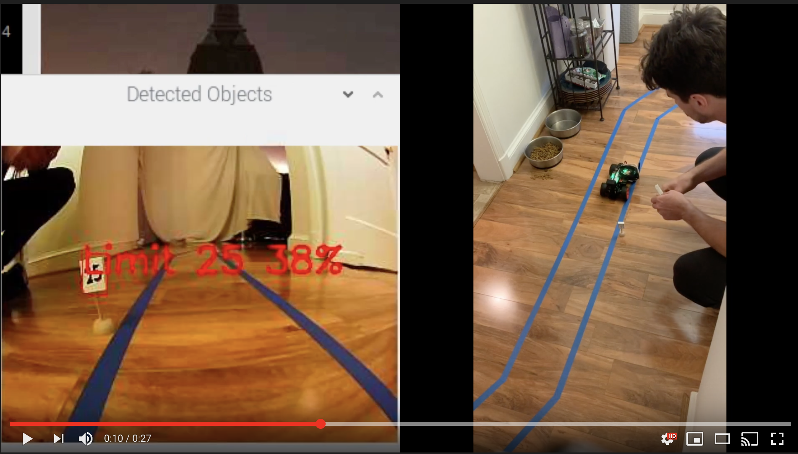](https://youtu.be/OwfQ79Ki54M)

### Practical Demonstration

Finally, to demonstrate all of this awesome behavior in one go, a demo was set up to emulate our aiPiCar driving through a "School Zone". In the example, the aiPiCar starts driving, while following lanes, at an initial speed of 40 mph. aiPiCar then enters the school zone and recognizes that speed limit has been reduced to 25 mph, and continues lane following. aiPiCar waits for a person who has stopped in the middle of the street, and continues through the school zone at 25 mph, until it reaches a stop sign and waits for 3 seconds before proceeding at 25mph. Finally, the aiPiCar recognizes the 40 mph sign indicating the end of the school zone, and sets its speed back to 40 mph. BUT WAIT! A Student has jumped into the road outside the school zone! That is ok for aiPiCar, as it brings itself to a stop, and waits for the student to clear the road.

The aiPiCar school zone behavior demonstration video is below.

[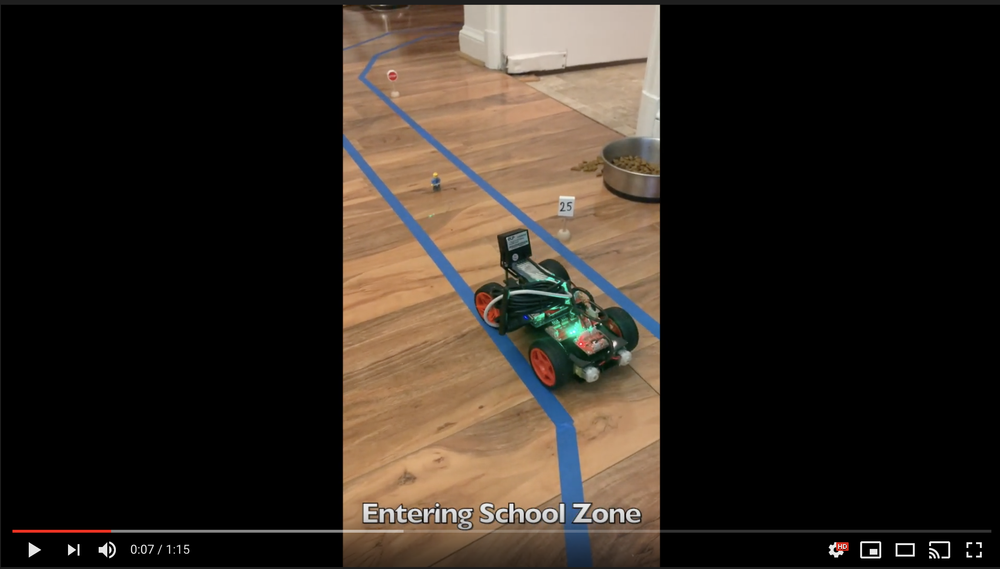](https://youtu.be/zq48dmnHe-U)

## Lessons Learned, Opportunities for Future Teams, and Additional Research Topics

Paragraph about lessons learned, opportunities for future teams
Teach itself lane driving (end-to-end) not above
Teach itself what to do with objects (end-to-end) not rules based
speed limits only trained, not all
