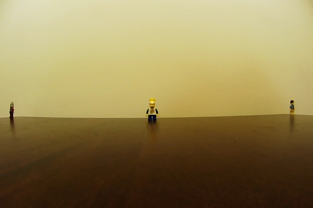

# aiPiCar - DGMD Fall 2019

## Building a Self-Driving Raspberry Pi Car Capable of Lane Following, Object Recognitions and Obstacle Avoidance
### Project by: Alex Andony


## Project Introduction and Overview

Pick up any news source today, and you’ll likely see something about autopilot technology. Whether it’s lane assistance on production cars, self driving fully autonomous vehicles on the streets of LA, delivery drones autopiloting themselves to delivery drops, or worse, a recent accident caused by testing of these emerging technologies, we can be certain that the industry is rapidly advancing towards adoption of autopilot technology. 

Although major corporations like Tesla and Amazon are pouring billions of dollars into this technology, the practical applications can be learned and demonstrated on a much smaller scale. The goal of this project is to demonstrate these technological concepts using a small Robotic Car powered by a Raspberry Pi, at a price tag under $400. 

#### In order to demonstrate the above technology, we outlined the following goals to demonstrate this behavior:
* Assemble the PiCar Kit and Base Raspberry Pi Operating System 
* Demonstrate Autonomous “Lane Following” through OpenCV
* Demonstrate Advanced Autonomous “Lane Following” using Deep Learning and TensorFlow
* Demonstrate Advanced Camera recognition features, including adapting to street signs and basic obstacle avoidance

#### The build was inspired and heavily influenced by the following web pages:
* [Building a Raspberry Pi Car Robot with WiFi and Video](https://www.hanselman.com/blog/BuildingARaspberryPiCarRobotWithWiFiAndVideo.aspx)
* [DeepPiCar — Part 1: How to Build a Deep Learning, Self Driving Robotic Car on a Shoestring Budget](https://towardsdatascience.com/deeppicar-part-1-102e03c83f2c)
* [Road Lane Detection with Raspberry Pi](https://www.hackster.io/Abhinav_Abhi/road-lane-detection-with-raspberry-pi-a4711f)

## Hardware and Software Overview
#### Hardware Used for aiPiCar:
* Car Kit Used: [SunFounder Smart Car Kit](https://www.amazon.com/gp/product/B06XWSVLL8/ref=ppx_yo_dt_b_asin_title_o00_s02?ie=UTF8&psc=1)
* CPU: [Raspberry Pi 3 B+ (B Plus)](https://www.amazon.com/gp/product/B07BC6WH7V/ref=ppx_yo_dt_b_asin_title_o00_s02?ie=UTF8&psc=1)
* MicroSD: [Kingston 64GB MicroSD Card](https://www.amazon.com/gp/product/B079GVC5B8/ref=ppx_yo_dt_b_asin_title_o00_s00?ie=UTF8&psc=1)
* Batteries: [Generic 18650 Batteries x4 + Charger](https://www.amazon.com/gp/product/B07T93HQYZ/ref=ppx_yo_dt_b_asin_title_o00_s01?ie=UTF8&psc=1)
* Upgrade 1 - Wide Angle Camera: [WLP Wide Angle USB Camera](https://www.amazon.com/gp/product/B01N07O9CQ/ref=ppx_yo_dt_b_asin_title_o00_s02?ie=UTF8&psc=1)
* Upgrade 2 - CPU Upgrade: [Coral EdgeTPU USB Accelerator](https://www.amazon.com/gp/product/B07S214S5Y/ref=ppx_yo_dt_b_asin_title_o00_s03?ie=UTF8&psc=1)

#### Software Used for aiPiCar:
* Raspberry Pi OS: [Rasbpian Buster v. Sept 2019](https://www.raspberrypi.org/downloads/raspbian/)
* Remote File Server: Samba File Server 
``` ~sudo apt-get install samba samba-common-bin -y ```
* Camera Driver Utlity: v4l2 Linux 
``` ~sudo apt-get install v4l-utils ```
* Remote Car Control: SunFounder PiCar ``` ~git clone https://github.com/dctian/SunFounder_PiCar.git ```
* Python v3.7.3
* Open CV v4.1.1
* Matplotlib v3.0.2
* tensorflow v1.14.0
* Keras v2.3.1

#### Hardware/ Software for Laptop Setup:
* Laptop: Apple Macbook Pro
* Software: macOS Catalina v10.15.1
* MicroSD card flasher for Pi: [BalenaEtcher](https://www.balena.io/etcher/)
* Remote Desktop Viewer for Pi: [RealVNC](https://www.realvnc.com/en/connect/download/viewer/)

#### Additional Resources Used:
* Lego Figurines 10 Pack (Amazon)
* Street Signs: [Attatoy Kids Playset Signs](https://www.amazon.com/gp/product/B01A8XTHHA/ref=ppx_yo_dt_b_asin_title_o00_s01?ie=UTF8&psc=1)
* Blue Painters Tape for Lanes (Hardware Store)

## Building the aiPiCar

Bulding the aiPiCar was relatively easy. For the most part, I was able to follow the instructions from the manufacturer, with a few key diviations outlines below.

[Manufacturer Build Instructions](https://www.sunfounder.com/learn/download/X1BWQ19SYXNwYmVycnlfUGlfU21hcnRfVmlkZW9fQ2FyX1YyLjAucGRm/dispi)


###### PiCar Components Laid Out

### Installing Heatsinks

**(Before Page 16, PCB Assembly)** - Install heatsinks on Respberry Pi Board

Before Installing the HATS on the Pi board during install, I needed to install the heatsinks directly to the Raspberry Pi board. To do so, all that was required was to remove the backing strip on the heatsink to expose the adhesive paste, and to push the ehatsinks onto the CPU and network card as shown below:


###### Heatsinks applied to Pi Board

### Installing Upgraded Camera

**(Before Page 33, Pan-and-Tilt)** - Install upgraded USB Camera on aiPiCar

As recommended on the build site I referenced above, the camera that ships with the PiCar kit is an extremely low quality narrow lens. I ordered a 170 degree wide angle USB camera as a replacement, which was relatively easy to install with slight modification to the stock mounting plate. The experiment below illustrates the difference between the stock and “upgraded” camera.


###### Camera Placed roughly 16" from lego figurines on table


###### Stock Camera View at 16"



###### Upgraded Camera at 16"

To install the camera, rather than installing the stock pan and tilt servos, I secured the USB Camera directly to the Servo Plate using two M3x8 Cross Screws and M3 Nuts. The camera provided a wide enough lens that the pan and tilt servos were unnecessary.


###### Upgraded Camera Mounted on Servo Plate

### Installing Edge TPU Processor

**(Before Page 33, Pan-and-Tilt)** - Install Google EdgeTPU Processor

In order to take some of the processing load off of the Pi for image processing and running Object Detection in TensorFlow, I installed Google’s Edge Tensor Processing Unit USB. At an extremely low cost, it was an easy upgrade to allow the car to process images much more rapidly while leaving the onboard Pi CPU open for performing navigation.

Physical installation was very easy. I simply threaded one M3x8 screw through the top corner of the edgeTPU and secured it with an M3 nut. 


###### Google edgeTPU mounted to Servo Plate behind camera

## Raspberry Pi Software Setup

### RaspianOS Install

I installed Raspbian OS directly from the Raspberry Pi site. I initially tried to use the NOOBS installer package, but ran into issues with a known software bug no allowing the NOOBS installer to display on an HDMI connected monitor. To solve this, I reformatted the microSD card and flashed the RaspianOS directly to the card using BalenaEtcher (linked above). After reconnecting the HDMI, keyboard and mouse, I was able to see the Pi desktop below:


### Setup Remote Client to macOS: 

After the RaspianOS was setup on the Pi and I was able to see the desktop, the next goal was to setup a VNC Server on the Pi and VNC Viewer on macOS. I used the free software RealVNC to accomplish this.

Step One: Enable SSH and VNC through the Pi’s Interface Settings


Step Two: Download RealVNC on Mac and enter the IP address of the Pi


